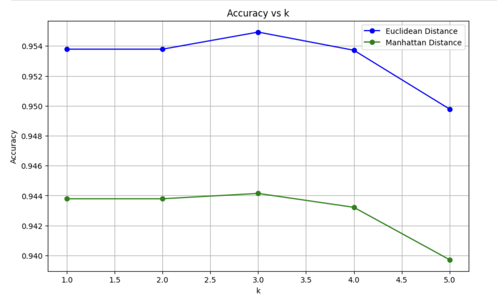
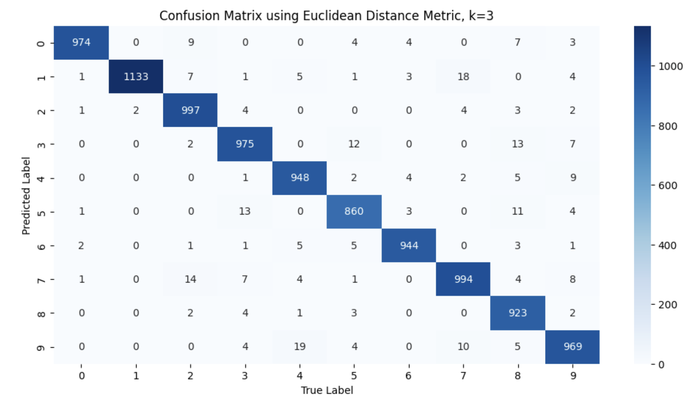
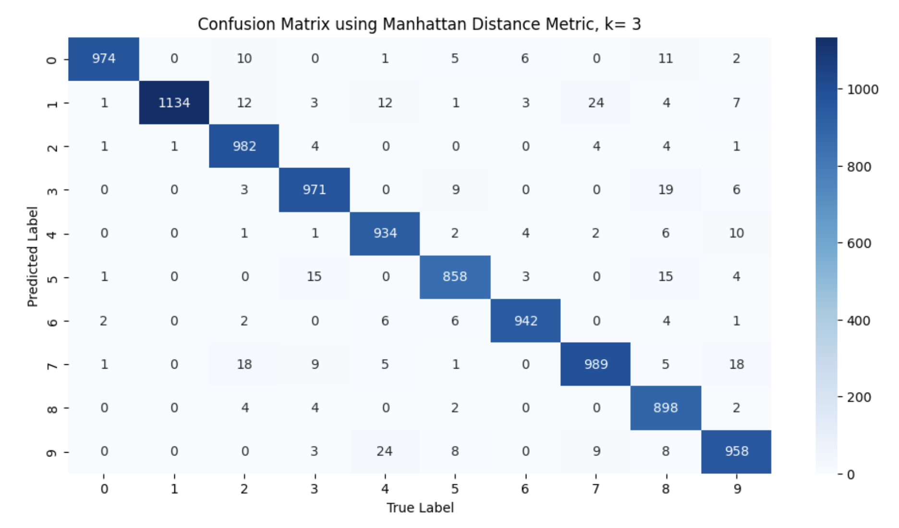

# Hi, I'm Haris! 👋

[](https://choosealicense.com/licenses/mit/) 

# K Nearest Neighbours

The repository contains the following files:

* **KNN.ipynb** – contains code for training and evaluating the KNN and rNN models on their respective datasets
* **KNN.py** – corresponding .py file for the Jupyter Notebook
* **mnist.zip** – contains the dataset required for the KNN part of the Jupyter Notebook
* **breast-cancer.csv** – contains the dataset required for the rNN part of the Jupyter Notebook
* **breast-cancer.xlsx** – corresponding Excel file for easier visualization <br>


## Table of Contents

1. [Introduction](#introduction)
2. [Installation Requirements](#installation-requirements)
3. [Assignment Overview](#assignment-overview)
4. [Data](#data)
5. [Training and Evaluation](#training-and-visualization)
6. [Screenshots](#screenshots)
   
## Introduction

This project investigates two distance-based classification algorithms — **K-Nearest Neighbors (KNN)** and **Radius-Based Nearest Neighbors (rNN)** — applied to different datasets to evaluate their effectiveness in real-world classification tasks.

* **K-Nearest Neighbors (KNN)** is a simple, non-parametric algorithm that classifies data points based on the majority label of their 'K' closest neighbors in the training set. It relies on a distance metric (typically Euclidean distance) to determine proximity and is especially effective when the decision boundaries are irregular or non-linear.

* **Radius-Based Nearest Neighbors (rNN)** is a variant of the KNN algorithm. Instead of selecting a fixed number of neighbors, it considers **all training samples within a given radius** of the query point. If no neighbors are found within that radius, the point may be left unclassified. This makes rNN more adaptive in datasets where data density varies significantly across the feature space.


## Installation Requirements

To run the notebooks in this repository, you will need the following packages:


!pip install idx2numpy

* `numpy`
* `pandas`
* `matplotlib`
* `seaborn`
* `statistics`
* `PIL`
* `scikit-learn`
* `idx2numpy`


You can install these packages using pip:

```bash
pip install numpy
```

```bash
pip install pandas
```

```bash
pip install matplotlib
```

```bash
pip install seaborn
```

```bash
pip install statistics
```

```bash
pip install PIL
```

```bash
pip install scikit-learn
```


To install the idx2numpy library, simply run the first code block in the KNN.ipynb file. 

```bash
!pip install idx2numpy
```

After installing the required libraries, run the **"Imports"** cell in the notebook to begin.

Useful Links for installing Jupyter Notebook:
- https://youtube.com/watch?v=K0B2P1Zpdqs  (MacOS)
- https://www.youtube.com/watch?v=9V7AoX0TvSM (Windows)

It's recommended to run this notebook in a conda environment to avoid dependency conflicts and to ensure smooth execution.
Also, you will need a GPU to run the notebooks. It is recommended to have a Google Colab Account (perhaps multiple accounts) for this purpose.
<h4> Conda Environment Setup </h4>
<ul> 
   <li> Install conda </li>
   <li> Open a terminal/command prompt window in the assignment folder. </li>
   <li> Run the following command to create an isolated conda environment titled AI_env with the required packages installed: conda env create -f environment.yml </li>
   <li> Open or restart your Jupyter Notebook server or VSCode to select this environment as the kernel for your notebook. </li>
   <li> Verify the installation by running: conda list -n AI_env </li>
   <li> Install conda </li>
</ul>


## Assignment Overview


The `KNN.ipynb` Jupyter Notebook forms the core of this assignment and is organized into three main sections, each focusing on a different implementation or variant of nearest neighbors classification:

### 1. **K-Nearest Neighbors (KNN) from Scratch**

In this section, the KNN algorithm is implemented manually from first principles using only basic Python libraries such as `numpy`. This includes:

* Calculating Euclidean and Manhattan distances between input points
* Identifying the K nearest neighbors
* Performing majority voting to assign class labels

The MNIST dataset is used for experimentation, where images are flattened and fed into the custom KNN classifier. This part demonstrates a fundamental understanding of how the algorithm works internally and allows for greater flexibility in modifying or visualizing intermediate steps.

### 2. **K-Nearest Neighbors using Scikit-learn**

This section utilizes the `KNeighborsClassifier` class from the `scikit-learn` library to apply KNN on the same MNIST dataset. Key highlights include:

* Using `train_test_split` to divide the dataset
* Training the scikit-learn KNN model with various values of *K*
* Evaluating model performance using accuracy scores and confusion matrices

This part allows us to compare results with the manual implementation.

### 3. **Radius-Based Nearest Neighbors (rNN)**

The final section focuses on **Radius Neighbors Classification**, a variant of KNN where a fixed radius is used instead of a fixed number of neighbors. The breast cancer dataset is used for this task, with features extracted from the `.csv` file. Key steps include:

* Preprocessing the data (handling missing values, normalization)
* Training the radius-based classifier with a defined radius
* Evaluating results using classification metrics

This part demonstrates how rNN can adapt better in situations with varying data density, offering a complementary approach to traditional KNN.


## Data

This assignment utilizes **two diverse datasets** to explore the applications of nearest neighbors classification: one focused on image recognition and the other on medical diagnostics. Each dataset is tailored to a specific part of the assignment, highlighting different use cases for KNN and radius-based classifiers.


### 1. **MNIST Dataset – Handwritten Digit Recognition**

The **MNIST (Modified National Institute of Standards and Technology)** dataset is a benchmark dataset in computer vision, widely used for training and evaluating classification models. It contains:

* **70,000 grayscale images** of handwritten digits (0 to 9)
  * 60,000 images for training
  * 10,000 images for testing
* Each image is of size **28x28 pixels**, resulting in **784 features per sample** when flattened into a vector.
* The data is labeled with the corresponding digit, making it a **multiclass classification** problem with 10 output classes.

In this assignment:

* The MNIST dataset is used for both the **KNN from scratch** and the **scikit-learn KNN** implementations.
* The pixel values are normalized and used to train the classifiers to predict the digit class of unseen samples.
* The dataset is provided as a compressed file (`mnist.zip`), which is extracted and loaded using helper functions or data loaders within the notebook.

When you download the `mnist.zip` folder, you will have the following files:

* t10k-images.idx3-ubyte
* t10k-labels.idx1-ubyte
* train-images.idx3-ubyte
* train-labels.idx1-ubyte

Move these files into your assignment directory.

### 2. **Breast Cancer Dataset – Tumor Classification**

The **Breast Cancer dataset** is a classic dataset used for binary classification tasks in medical diagnostics. It is based on features extracted from digitized images of fine needle aspirates (FNAs) of breast masses. The dataset includes:

* **569 samples**, each representing a patient’s diagnostic test
* **30 numeric features** that describe properties of the cell nuclei
* A binary label indicating whether the tumor is **benign (B)** or **malignant (M)**

In this assignment:

* The dataset is used in the **Radius-Based Nearest Neighbors (rNN)** section.
* The data is read from `breast-cancer.csv` (and optionally visualized in `breast-cancer.xlsx`).


## Training and Visualization

The entire training process alongside the relevant evaluations and visualizations are explained in detail in the jupyter notebook. 


## Screenshots

<h4> 1. This image shows the confusion matrix when the Multinomial Naive Bayes classifier is evaluated on the test dataset.  </h4>
 <br> 

<h4> 2. This image shows the confusion matrix when the Logistic Regression classifier is evaluated on the test dataset. </h4>
 <br> 

<h4> 3. This image shows the confusion matrix when the Neural Network classifier is evaluated on the test dataset. </h4>

 <br> 
 
## License

[MIT](https://choosealicense.com/licenses/mit/)


